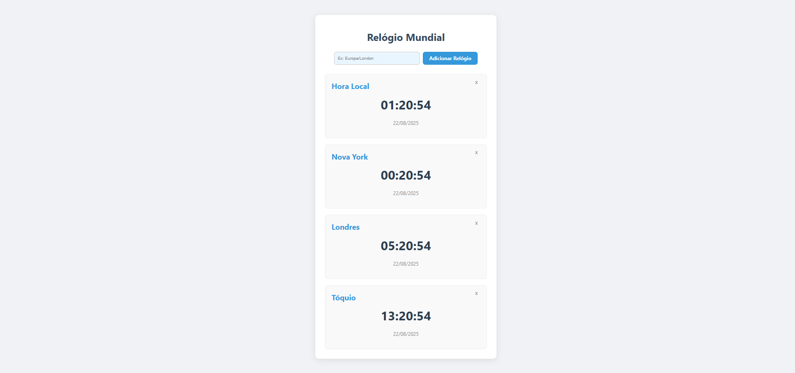

# Relógio Mundial

Este é um aplicativo de relógio mundial construído com React que exibe a hora atual em diferentes fusos horários. O projeto foi desenvolvido para facilitar a comunicação e o agendamento de reuniões com pessoas em outras partes do mundo, resolvendo a dor de cabeça de ter que converter horários manualmente.

## Tecnologias

- **React**: Biblioteca JavaScript para a construção de interfaces de usuário reativas.
- **TypeScript**: Adiciona tipagem estática, garantindo um código mais seguro e robusto.
- **Vite**: Ferramenta de build moderna e rápida, ideal para um ambiente de desenvolvimento ágil.
- **Intl.DateTimeFormat API**: Uma API nativa do navegador que permite formatar datas e horas de acordo com fusos horários específicos, eliminando a necessidade de bibliotecas de terceiros para essa funcionalidade.

## Funcionalidades

- **Múltiplos Relógios**: Exibe a hora e a data em tempo real para múltiplos fusos horários selecionados.
- **Relógio Dinâmico**: Os relógios são atualizados a cada segundo, garantindo a precisão.
- **Adicionar e Remover Relógios**: Funcionalidade dinâmica para adicionar novos relógios de fusos horários diferentes e remover os existentes.
- **Interface Limpa e Profissional**: O design utiliza um layout de grade para uma visualização clara e um esquema de cores moderno.

## Como Executar o Projeto

Para rodar a aplicação localmente, siga os seguintes passos no seu terminal:

1. Navegue até o diretório do projeto:

    ```bash
    cd relogio-mundial
    ```

2. Instale as dependências:

    ```bash
    npm install
    ```

3. Inicie o servidor de desenvolvimento:

    ```bash
    npm run dev
    ```

A aplicação estará disponível em `http://localhost:5173/`.

## Estrutura do Projeto

- **`src/App.tsx`**: Contém a lógica principal da aplicação, incluindo o gerenciamento do estado dos relógios e as funções para adicionar e remover relógios.
- **`src/App.css`**: Define a estilização de todos os componentes da interface.

## Funcionalidades Futuras

O projeto pode ser expandido para incluir as seguintes funcionalidades:

1. **Persistência de Dados**: Salvar a lista de fusos horários no `localStorage` para que a seleção do usuário persista ao recarregar a página.
2. **Busca com Autocomplete**: Adicionar um sistema de busca com sugestões para facilitar a localização e a adição de fusos horários.
3. **Personalização**: Permitir que o usuário renomeie os relógios para um nome mais amigável (ex: "Hora em casa", "Hora do escritório").

---

Com esta documentação, seu projeto está completo. Ele demonstra um excelente domínio do React, do gerenciamento de estado e do trabalho com APIs nativas do navegador.

O que você achou do resultado final e da documentação?

# Detalhe do projeto

